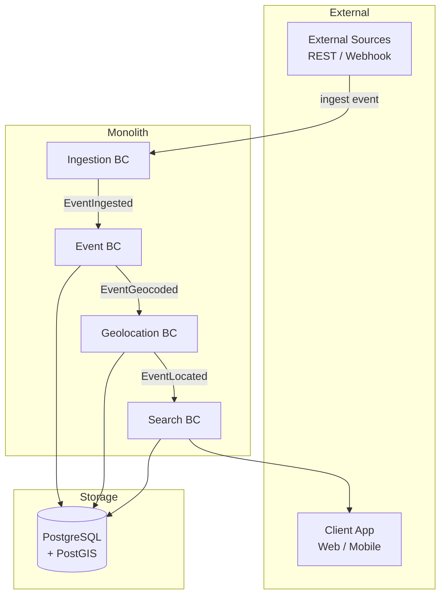
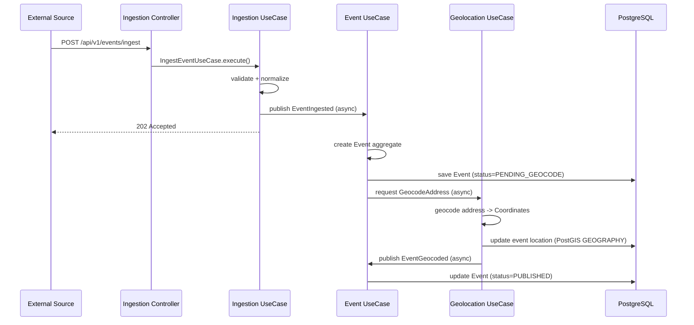

# Geolocalized Event Aggregator — Architecture Plan

## 1. Design Principles

| Principle | Application |
|---|---|
| **Hexagonal Architecture** | Every bounded context exposes **ports** (interfaces) and has **adapters** (controllers, persistence, event listeners). Domain logic is pure — zero framework annotations. |
| **Event-Driven Ingestion** | Incoming events are published as domain events. Internal communication uses Spring `ApplicationEvent` (async). Can be swapped to Kafka without changing domain code. |
| **Modular Monolith first** | All bounded contexts in the same deployable unit (`jar`). Split into microservices only if there is proven scaling pressure. |
| **Avoid overengineering** | No CQRS, no saga orchestration, no event sourcing unless needed. Simple async events + optimistic concurrency. |
| **Production-ready** | Health checks, structured logging, graceful shutdown, connection pooling, Flyway migrations. |

---

## 2. Bounded Contexts



### 2.1. `ingestion` — Event Ingestion

**Responsibility:** Receive raw event data from external sources (crawlers, partner APIs, webhooks). Validate, normalize, and publish as a domain event.

- **Ports:** `EventIngestor` (inbound), `EventPublisher` (outbound)
- **Adapters:** REST controller `/api/v1/events`, `HttpSourceAdapter` for webhooks
- **Domain:** `RawEvent`, `IngestionResult`, `Source` value object

### 2.2. `event` — Event Management

**Responsibility:** Core domain. Stores canonical event data with validated fields. Enriches events (deduplication, category inference).

- **Ports:** `EventRepository` (outbound), `GeocodeRequestor` (outbound, calls Geolocation BC)
- **Adapters:** JPA repository, internal Spring event listener
- **Domain:** `Event`, `Category`, `Schedule`, `Organizer`

### 2.3. `geolocation` — Geolocation

**Responsibility:** Geocode addresses to lat/lng, manage spatial queries, reverse geocode.

- **Ports:** `GeocodingService` (inbound), `GeocodingProvider` (outbound, e.g. Nominatim / Photon)
- **Adapters:** PostGIS `GEOGRAPHY` queries, `PhotonGeocodingAdapter`
- **Domain:** `Coordinates`, `Address`, `GeoBounds`

### 2.4. `search` — Search & Discovery (future, minimal)

**Responsibility:** Provide filtered queries (by location radius, date, category). Initially a thin read layer over the Event BC tables.

- **Ports:** `EventQuery` (inbound)
- **Adapters:** REST controller `/api/v1/search`
- **Domain:** `SearchCriteria`, `SearchResult`

> **Note:** In V1 this is just a query projection. It can later become its own read model or Elasticsearch index.

---

## 3. Package Structure

```
io.irn.geoloc
├── ZoocodeEventsApplication.java
│
├── shared/
│   └── kernel/
│       ├── DomainEvent.java              # Marker interface
│       ├── EventPublisher.java            # Port interface
│       └── ValueObject.java               # Marker interface
│
├── ingestion/
│   ├── domain/
│   │   ├── model/
│   │   │   ├── RawEvent.java
│   │   │   ├── Source.java               # enum: WEBHOOK, API, CRAWLER
│   │   │   └── IngestionResult.java
│   │   └── port/
│   │       └── EventIngestor.java         # Inbound port
│   │
│   ├── application/
│   │   ├── IngestEventUseCase.java
│   │   └── IngestionMapper.java
│   │
│   ├── infrastructure/
│   │   └── event/
│   │       └── SpringEventPublisher.java  # Adapter: DomainEvent -> ApplicationEvent
│   │
│   └── adapter/
│       ├── web/
│       │   └── EventIngestionController.java
│       └── listener/
│           └── ExternalWebhookListener.java
│
├── event/
│   ├── domain/
│   │   ├── model/
│   │   │   ├── Event.java                # Aggregate root
│   │   │   ├── Category.java
│   │   │   ├── Schedule.java
│   │   │   ├── Organizer.java
│   │   │   └── EventStatus.java          # enum: DRAFT, PUBLISHED, CANCELLED
│   │   ├── event/
│   │   │   ├── EventIngested.java        # Domain event
│   │   │   └── EventGeocoded.java
│   │   └── port/
│   │       ├── EventRepository.java       # Outbound port
│   │       └── GeocodeRequestor.java      # Outbound port
│   │
│   ├── application/
│   │   ├── CreateEventHandler.java
│   │   ├── GeocodeEventHandler.java
│   │   └── dto/
│   │       └── EventSummary.java
│   │
│   ├── infrastructure/
│   │   ├── persistence/
│   │   │   ├── EventJpaRepository.java
│   │   │   ├── EventEntity.java
│   │   │   └── EventMapper.java
│   │   └── event/
│   │       └── SpringDomainEventListener.java
│   │
│   └── adapter/
│       └── web/
│           ├── EventController.java
│           └── EventController.java
│
├── geolocation/
│   ├── domain/
│   │   ├── model/
│   │   │   ├── Coordinates.java          # Value object with lat/lng
│   │   │   ├── Address.java
│   │   │   └── GeoBounds.java
│   │   └── port/
│   │       ├── GeocodingService.java      # Inbound port
│   │       └── GeocodingProvider.java     # Outbound port
│   │
│   ├── application/
│   │   ├── GeocodeAddressUseCase.java
│   │   └── SearchNearbyUseCase.java
│   │
│   ├── infrastructure/
│   │   ├── persistence/
│   │   │   └── EventLocationRepository.java   # PostGIS spatial queries
│   │   └── geocoding/
│   │       └── PhotonGeocodingAdapter.java    # Adapter: external API
│   │
│   └── adapter/
│       └── listener/
│           └── GeocodeEventListener.java
│
└── search/
    ├── domain/
    │   └── port/
    │       └── EventQuery.java             # Inbound port
    │
    ├── application/
    │   └── SearchEventsUseCase.java
    │
    ├── infrastructure/
    │   └── persistence/
    │       └── EventSearchRepository.java
    │
    └── adapter/
        └── web/
            └── SearchController.java
```

---

## 4. Event Flow (End-to-End)



---

## 5. Database Schema (Key Tables)

```sql
-- Extension required for geolocation
CREATE EXTENSION IF NOT EXISTS postgis;

CREATE TABLE events (
    id            UUID PRIMARY KEY,
    title         VARCHAR(200) NOT NULL,
    description   TEXT,
    category      VARCHAR(50),
    status        VARCHAR(20) NOT NULL DEFAULT 'DRAFT',
    source        VARCHAR(20) NOT NULL,
    source_id     VARCHAR(100),                -- ID from external source
    organizer     VARCHAR(200),
    start_at      TIMESTAMP WITH TIME ZONE NOT NULL,
    end_at        TIMESTAMP WITH TIME ZONE,
    created_at    TIMESTAMP WITH TIME ZONE NOT NULL,
    updated_at    TIMESTAMP WITH TIME ZONE NOT NULL
);

CREATE TABLE event_locations (
    id            UUID PRIMARY KEY REFERENCES events(id),
    address       TEXT,
    city          VARCHAR(100),
    country       VARCHAR(100),
    geom          GEOGRAPHY(Point, 4326) NOT NULL,   -- PostGIS spatial column
    created_at    TIMESTAMP WITH TIME ZONE NOT NULL
);

CREATE INDEX idx_event_locations_geom ON event_locations USING GIST (geom);
CREATE INDEX idx_events_status ON events (status);
CREATE INDEX idx_events_start_at ON events (start_at);
CREATE UNIQUE INDEX idx_events_source ON events (source, source_id);
```

---

## 6. Technology Choices

| Component | Choice | Rationale |
|---|---|---|
| Framework | Spring Boot 4.0.x | Required. Latest stable with Java 25 support. |
| Language | Java 25 | Required. Records for DTOs, sealed classes for domain model. |
| Database | PostgreSQL 16 + PostGIS | Spatial queries, GIST indexes, JSONB for flexible fields. |
| Migrations | Flyway | Versioned, repeatable, production-safe. |
| Async Events | Spring `ApplicationEvent` + `@Async` | Zero infrastructure, can be swapped for Kafka later. |
| Geocoding | Photon API | Free, fast, no API key needed for low volume. |
| Testing | JUnit 5 + Testcontainers | Integration tests with real PostgreSQL + PostGIS. |
| API Docs | SpringDoc OpenAPI | Auto-generated, production documentation. |
| Monitoring | Spring Actuator | Health checks, metrics, readiness probes. |

---

## 7. Why NOT Overengineering

| Complex pattern | Decision | Why it's not needed yet |
|---|---|---|
| Microservices | ❌ Modular monolith | < 10 devs, single domain, less operational cost. |
| Kafka / RabbitMQ | ❌ Spring Events | Single JVM, no need for persistent message log yet. |
| Event Sourcing | ❌ State-based persistence | No audit requirement, simpler querying. |
| CQRS | ❌ Single read/write model | Query load is low, one DB is enough. |
| API Gateway | ❌ Direct controllers | Single deployable, no routing needed. |
| Kubernetes | ❌ Single JAR + Docker | Docker Compose is enough for launch. |

When scaling pressure appears, the migration path is clear:
1. Extract a BC into its own service (clear ports/adapters boundaries)
2. Swap `SpringEventPublisher` for `KafkaTemplate`
3. Add read replicas or Elasticsearch for search BC

---

## 8. Configuration Files (Key)

**`build.gradle`** (dependencies subset)
```
implementation 'org.springframework.boot:spring-boot-starter-web'
implementation 'org.springframework.boot:spring-boot-starter-data-jpa'
implementation 'org.springframework.boot:spring-boot-starter-validation'
implementation 'org.flywaydb:flyway-core'
implementation 'org.flywaydb:flyway-database-postgresql'
runtimeOnly 'org.postgresql:postgresql'
runtimeOnly 'net.postgis:postgis-jdbc:2023.1.0'
testImplementation 'org.springframework.boot:spring-boot-testcontainers'
testImplementation 'org.testcontainers:postgresql'
```

**`application.yml`**
```yaml
spring:
  datasource:
    url: jdbc:postgresql://localhost:5432/zoocode_events
    username: ${DB_USER:zoocode}
    password: ${DB_PASSWORD:zoocode}
  jpa:
    hibernate:
      ddl-auto: validate
  flyway:
    enabled: true
  task:
    execution:
      pool:
        core-size: 4
        max-size: 8

server:
  port: 8080

geocoding:
  provider: photon
  base-url: https://photon.komoot.io/api
```

---

## 9. V1 Implementation Roadmap

| Step | What | Depends on |
|---|---|---|
| 1 | Project scaffold: build.gradle, application.yml, Flyway migrations | — |
| 2 | `shared/kernel` — DomainEvent, EventPublisher, ValueObject interfaces | 1 |
| 3 | `event` BC — domain model, JPA persistence, REST CRUD | 2 |
| 4 | `ingestion` BC — RawEvent, IngestEventUseCase, async event publishing | 3 |
| 5 | `geolocation` BC — Coordinates, Photon adapter, PostGIS query | 3 |
| 6 | Integration tests (Testcontainers) covering the full ingest→geocode flow | 3,4,5 |
| 7 | `search` BC — spatial query endpoint `/api/v1/events/nearby` | 5 |
| 8 | Docker Compose (app + PostgreSQL + PostGIS) | 1 |